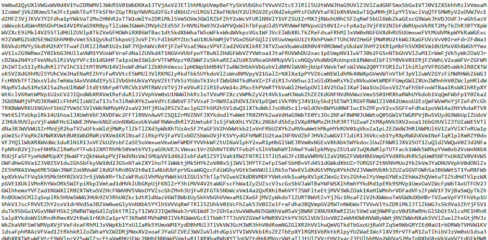
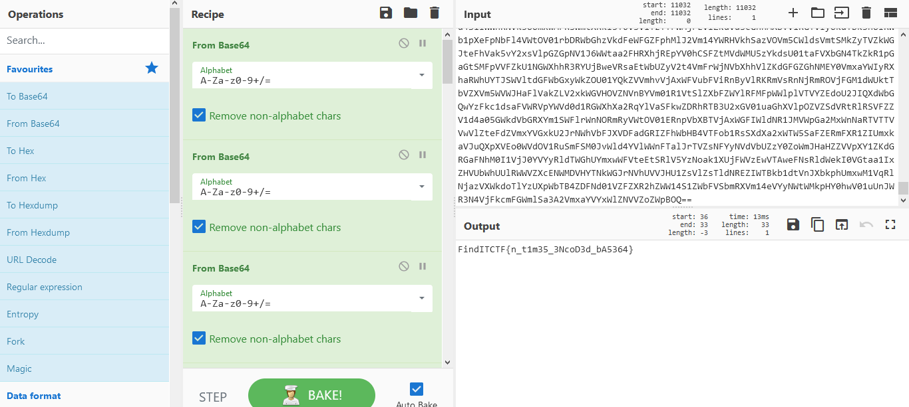

# CTF Competition – Find-IT UGM 2021

## {CYBER SEC FOSTI UMS}

## 64

## Overview
Category : Crypto

Description : Should be easy

## Pembahasan
Disini terdapat soal berupa cryptograph dengan tipe base 64

lalukan decode dengan menggunakan cyberchef agar lebih mudah dan cepat
> https://gchq.github.io/CyberChef/

dan lakukan bake beberapa kali hingga menemukan flag

dan flagnya adalah
> FindITCTF{n_t1m35_3NcoD3d_bA5364}
