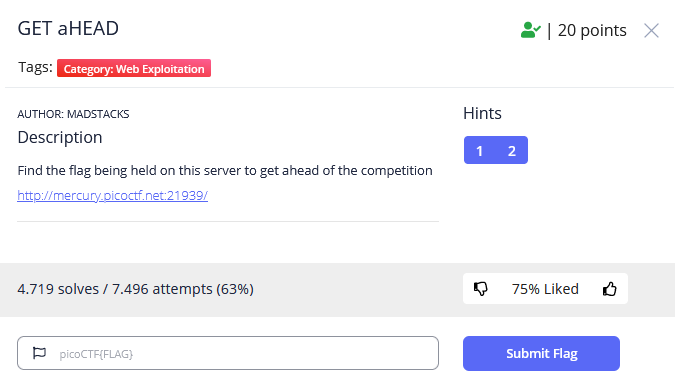
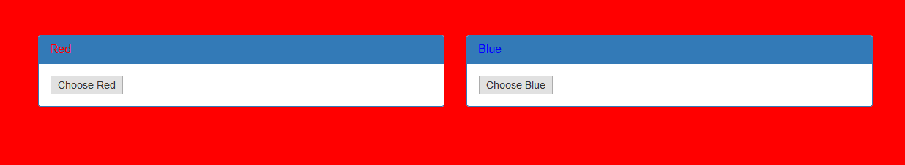
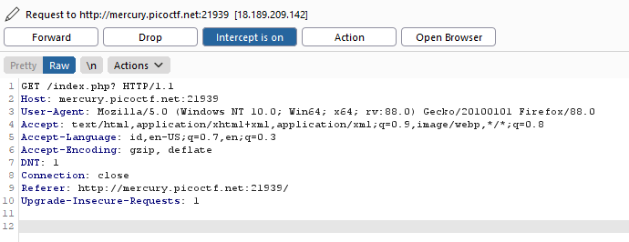
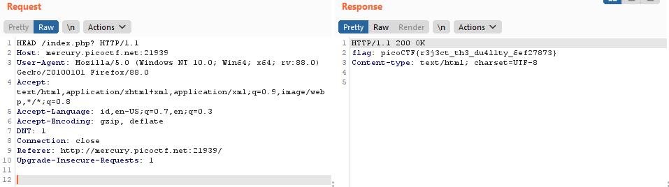

# BELAJAR CTF – {CYBER SEC FOSTI UMS}

## GET aHEAD

## Overview
Category : Web Exploitation
Points : 20 points

## Deskripsi
Author: madStacks
Find the flag being held on this server to get ahead of the competition http://mercury.picoctf.net:21939/

## Hints
1. Maybe you have more than 2 choices
2. Check out tools like Burpsuite to modify your requests and look at the responses

Pada soal ini terdapat hint juga pada nama soalnya  yaitu aHead, jadi ubah http requestnya menjadi HEAD

Disini pilih salah satunya kemudian ganti http request tersebut menjadi HEAD

pindah ke repeater agar mudah mendapat responsenya

maka terlihat flagnya pada response

## Flag
> picoCTF{r3j3ct_th3_du4l1ty_6ef27873}
