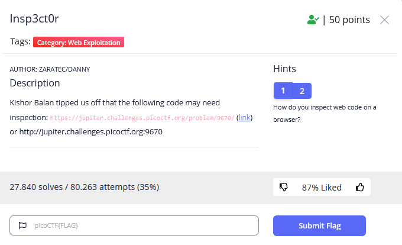
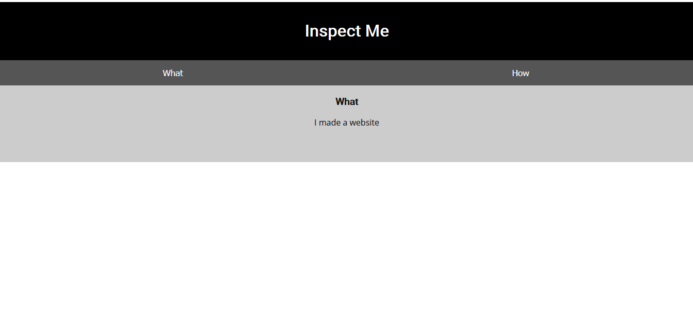
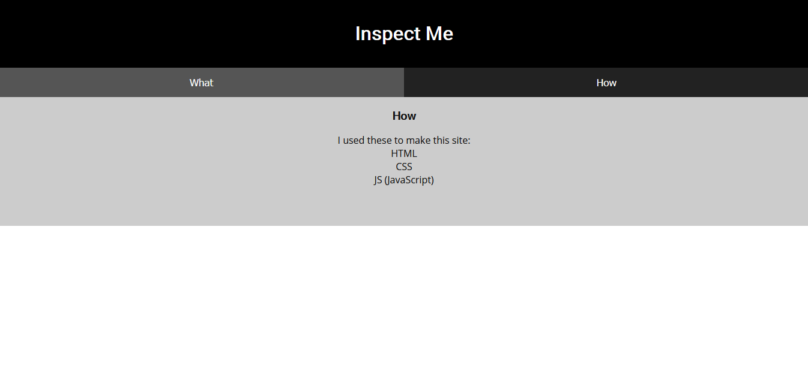
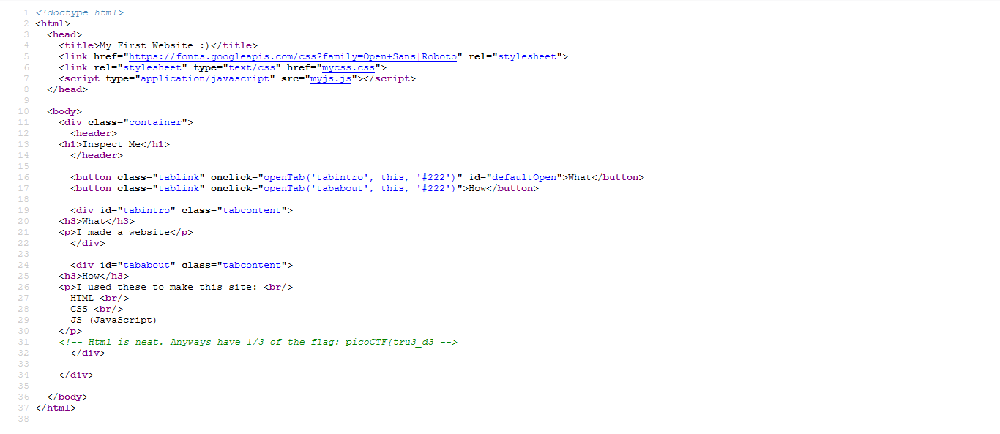
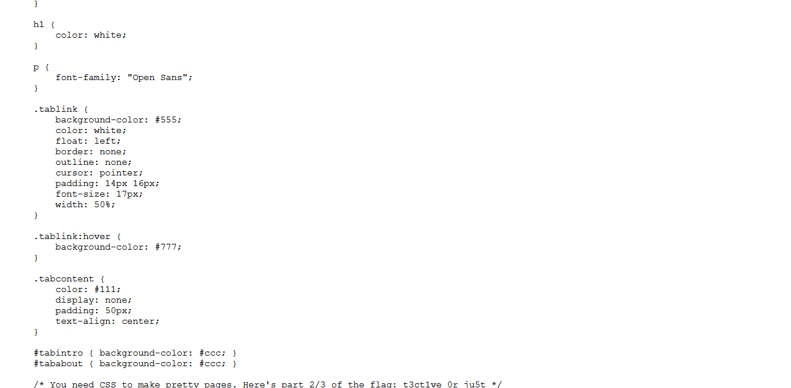

# BELAJAR CTF – {CYBER SEC FOSTI UMS}

Apa itu CTF?
Capture The Flag adalah salah satu jenis dari kompetisi keamanan siber yang berfokus mencari flag yang disembunyikan atau dilindungi dengan cara tertentu. 
Jenis CTF biasanya ada tiga yaitu jeopardy, attack-defense, dan campuran. 
Dan pada kali ini merupakan tipe jeopardy dan  menggunakan penilaian statis, yaitu nilai dari flag yang tetap seiring bertambahnya peserta yang berhasil mengerjakan.

## Insp3ct0r

## Overview
Category : Web Exploitation
Points : 50 points

## Deskripsi
Author: zaratec/danny

Kishor Balan tipped us off that the following code may need inspection: https://jupiter.challenges.picoctf.org/problem/9670/ 
(link) or http://jupiter.challenges.picoctf.org:9670

## Hints
1. How do you inspect web code on a browser?
2. There's 3 parts

Halaman dari soal tersebut adalah seperti ini. Dan terlihat ada What dan How, disitu terdapat hint untuk soal tersebut

Pada bagian How, terlihat hint untuk soal

Disini kita coba untuk melakukan view-source untuk melihat source codenya dengan cara
> ctrl + U

Maka selanjutnya akan terlihat ada file-file berupa css dan js, apabila kita lihat pada bagian bawah terdapat potongan flag
> flag 1 : picoCTF{tru3_d3

Masuk ke file mycss.css

Terdapat potongan flag lagi
> flag 2 : t3ct1ve_0r_ju5t

Masuk lagi ke file myjs.js

Dan potongan flag terakhir terlihat
> flag 3 : _lucky?2e7b23e3}

Flag
> picoCTF{tru3_d3t3ct1ve_0r_ju5t_lucky?2e7b23e3}
