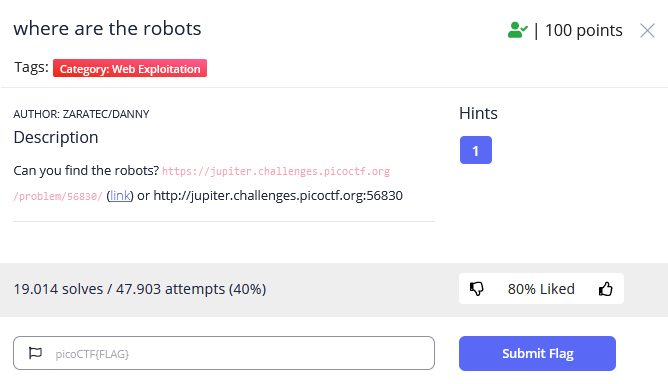
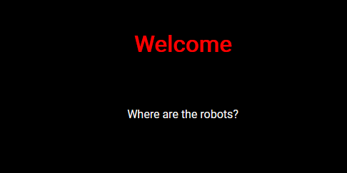
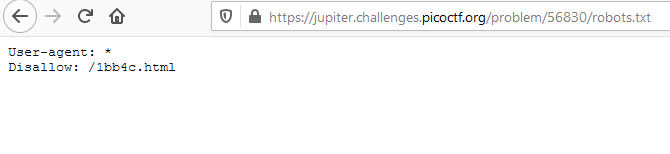
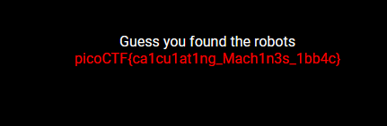

# BELAJAR CTF – {CYBER SEC FOSTI UMS}

## where are the robots

## Overview
Category : Web Exploitation
Points : 100 points

## Deskripsi
Author: zaratec/Danny
Can you find the robots? https://jupiter.challenges.picoctf.org/problem/56830/ (link) or http://jupiter.challenges.picoctf.org:56830

## Hints
What part of the website could tell you where the creator doesn't want you to look?

Gambaran halaman soal tersebut

Pada soal ini sebenarnya sudah terdapat hint dari nama soalnya yaitu robots. Lalu apa sih robots yang dimaksud ini,
> robots.txt adalah sebuah kode atau file yang digunakan untuk memberi instruksi pada robot search engine.

Setelah kita mengakses robots.txt maka akan terlihat seperti ini

Kemudian akses juga nama file tersebut maka akan mendapatkan flagnya

## Flag
picoCTF{ca1cu1at1ng_Mach1n3s_1bb4c}
